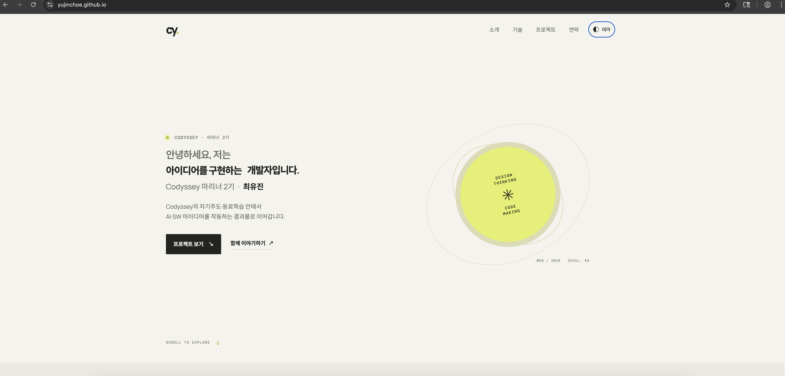
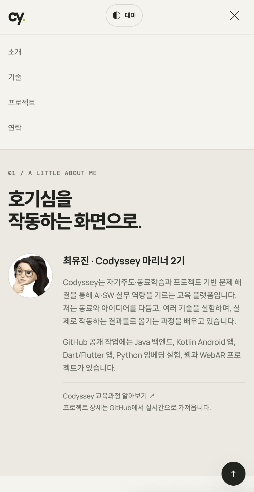
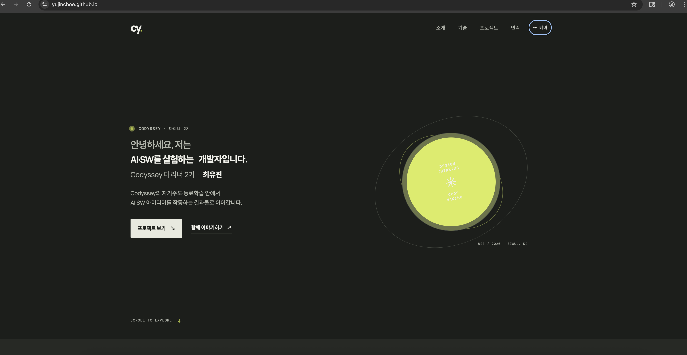

# 최유진 포트폴리오

**Codyssey 마리너 2기 최유진의 웹 포트폴리오**입니다. 자기주도·동료학습과 프로젝트 기반 학습으로 AI·SW 아이디어를 작동하는 결과물로 구현하는 과정을 소개합니다. Codyssey는 프로젝트 중심 문제 해결과 동료 학습을 통해 AI·SW 실무 역량을 기르는 교육 과정입니다 ([Codyssey 교육과정](https://codyssey.kr/apply/course)).

**사이트:** [https://yujinchoe.github.io](https://yujinchoe.github.io) · **GitHub:** [github.com/choe-yujin](https://github.com/choe-yujin)

## 화면

| 데스크톱 | 모바일 |
| --- | --- |
|  |  |

**다크 모드**



## 주요 기능

- 모바일·태블릿·데스크톱에 맞춘 반응형 레이아웃과 모바일 내비게이션
- 다크/라이트 테마 전환, `localStorage` 저장, 시스템 테마 감지
- 섹션 부드러운 이동, 스크롤 등장 효과, 맨 위로 가기
- Hero 문구 타이핑 효과와 모션 감소 설정 대응
- GitHub API 프로젝트 카드, 언어별 필터, 로딩·성공·오류·빈 상태
- 필수 입력과 이메일 형식 검증, Formspree 폼 전송 상태 표시

## 구현 구조

HTML은 콘텐츠 구조와 의미를, CSS는 시각 표현과 반응형 레이아웃을, JavaScript는 이벤트 처리와 상태 변경 및 DOM 업데이트를 담당합니다. 역할별 파일 분리는 각 계층의 수정 위치를 분명하게 하고 마크업과 동작 로직의 결합을 줄입니다.

```text
├── index.html       # 시맨틱 구조, 페이지 콘텐츠, 문의 폼
├── css/style.css    # CSS 변수, 테마, 레이아웃, 반응형 스타일
├── js/main.js       # 상태, 이벤트, GitHub API, 폼 처리와 DOM 렌더링
├── images/          # 데스크톱·모바일·다크 모드 캡처
└── README.md        # 프로젝트 설명과 평가 항목 구현 근거
```

## 평가 항목별 설명

### 1. 화면 동작과 사용자 경험

- **반응형:** 작은 화면 규칙을 기본으로 작성하고 600px, 768px, 1024px 미디어 쿼리에서 넓은 화면의 배치를 추가합니다. 모바일에서는 메뉴 링크를 숨기고 햄버거 버튼으로 엽니다.
- **테마 유지:** 테마 버튼의 `click` 이벤트가 `setTheme()`을 실행해 `STATE.theme`과 `<html>`의 `data-theme`을 갱신하고 설정을 `localStorage`에 저장합니다. 다음 방문에는 저장값을 복원하며, 저장값이 없으면 `prefers-color-scheme`을 읽습니다.
- **내비게이션과 스크롤:** 햄버거 버튼은 메뉴 상태와 `aria-expanded`를 갱신합니다. 섹션 링크는 부드럽게 이동하고, 스크롤 60px 초과 시 헤더 스타일을 바꾸며 300px 초과 시 맨 위로 버튼을 표시합니다. Intersection Observer의 임계값은 `0.2`입니다.
- **GitHub 프로젝트:** `loadProjects()`가 요청 중 스피너, 성공 카드, 오류와 재시도 버튼, 필터 결과가 없는 빈 상태를 각각 표시합니다.
- **폼 입력:** 입력 이벤트마다 필수값과 이메일 형식을 검사해 오류를 필드 가까이에 표시합니다. 제출 시에도 다시 검사하며, 유효한 내용은 Formspree로 보내고 전송 중·성공·실패 결과를 알립니다.

### 2. HTML, CSS, JavaScript의 역할과 선택

- **시맨틱 HTML:** `<header>`는 사이트 머리말, `<nav>`는 섹션 탐색, `<main>`은 주요 콘텐츠, `<section>`은 주제별 콘텐츠, `<article>`은 독립적으로 이해할 수 있는 프로젝트 카드, `<footer>`는 페이지 끝 정보를 나타냅니다. 요소는 모양이 아니라 콘텐츠의 역할과 문서 구조에 따라 선택합니다.
- **DOM:** 브라우저는 HTML을 읽으면 `<button>`, `<p>` 같은 태그를 JavaScript에서 찾고 바꿀 수 있는 요소로 준비합니다. 브라우저가 관리하는 이 페이지 요소들의 모음을 DOM이라고 부릅니다. 예를 들어 JavaScript는 `querySelector()`로 버튼이나 문단을 찾고, `textContent`로 글자를 바꾸거나 `classList`와 속성으로 상태를 표시할 수 있습니다.
- **CSS 변수:** `:root`에 색상·글꼴·간격·그림자 같은 반복 값을 정의하고 `[data-theme="dark"]`에서 테마 값을 재정의합니다. 한 값을 바꾸면 이를 사용하는 여러 요소에 일관되게 반영되고, 테마별 값도 모아 관리할 수 있습니다.
- **이벤트 연결:** HTML의 인라인 `onclick`은 마크업에 동작을 직접 섞어 구조와 로직을 결합합니다. `addEventListener()`는 JavaScript에서 이벤트 처리를 연결해 역할을 분리하고, 같은 이벤트에 여러 리스너를 등록할 수 있습니다. 이 프로젝트는 클릭·입력·제출·스크롤 처리를 모두 이벤트 리스너로 연결합니다.

### 3. 이벤트 → 상태 변경 → 화면 업데이트

`STATE` 객체가 기능에 필요한 값을 보관하고, 이벤트 핸들러가 상태를 갱신한 뒤 DOM 렌더링 함수를 호출하거나 관련 속성을 업데이트합니다.

**테마 토글**

1. 사용자가 HTML에 있는 테마 버튼을 클릭하면 브라우저가 `click` 이벤트를 발생시킵니다.
2. JavaScript의 `addEventListener()`로 연결해 둔 함수가 실행되고 `setTheme()`이 `STATE.theme`을 반대 값으로 바꿔 `localStorage`에 저장합니다.
3. `setTheme()`은 DOM에서 페이지의 `<html>` 요소를 바꿔 `data-theme="dark"` 또는 `data-theme="light"`를 설정하고, 버튼 아이콘과 접근성 레이블도 갱신합니다.
4. CSS는 바뀐 `data-theme` 값을 확인해 배경·글자 색을 적용합니다. 즉, **클릭 이벤트 → JavaScript의 상태 변경 → DOM 속성 변경 → CSS가 화면 색을 다시 표시**하는 순서입니다.

**GitHub API와 카드 렌더링**

1. 페이지 로드 또는 재시도 버튼 클릭으로 `loadProjects()`를 실행하고 `projectStatus`를 `loading`으로 설정합니다.
2. `renderProjects()`가 로딩 UI를 표시한 뒤 `await fetch()`로 `https://api.github.com/users/choe-yujin/repos?sort=updated&per_page=100`을 요청합니다.
3. `response.ok`가 거짓이거나 요청·응답 처리 중 예외가 발생하면 `catch`에서 `projectStatus`를 `error`로 바꾸고 재시도 UI를 렌더링합니다.
4. 성공 응답은 JSON으로 변환합니다. `filter()`가 fork·보관·비공개 저장소를 제외하고, 남은 저장소는 최신순으로 정렬해 `STATE.repos`에 보관합니다.
5. `map()`과 `Set`으로 중복 없는 언어 필터 버튼을 만듭니다. 선택 언어에 맞는 저장소를 다시 `filter()`한 뒤 `map()`으로 카드 HTML을 생성합니다.
6. 저장소가 없거나 선택 필터 결과가 없으면 빈 상태 문구를 표시합니다. API 요청 실패는 오류와 재시도 버튼으로 구분합니다.

**문의 폼**

입력 `input` 이벤트 → `STATE.form` 값과 오류 갱신 → `textContent` 및 `aria-invalid` 업데이트 순서로 즉각 피드백을 줍니다. `submit` 이벤트에서는 `preventDefault()`로 페이지 이동을 막고 모든 필드를 재검사합니다. 유효하면 `async` 제출 핸들러가 `fetch()`를 `await`하고, 성공 응답과 예외·오류 응답을 분기해 상태 문구를 바꿉니다. `finally`에서 전송 상태와 버튼을 복구합니다.

### 4. 상태 관리, 배열 메서드, 레이아웃

- **`STATE` 객체:** 테마·메뉴·스크롤·타이핑·프로젝트 요청과 필터·폼 입력을 기능별로 한곳에 모읍니다. 일반 변수도 쓸 수 있지만 상태가 흩어지면 관련 값의 위치와 갱신 시점을 추적하기 어렵습니다. 객체로 묶으면 이벤트가 어떤 값을 바꾸고 어떤 렌더링으로 이어지는지 확인하기 쉽습니다. 상태 객체 자체가 DOM을 자동 렌더링하지는 않으므로 상태 갱신 후 화면을 명시적으로 업데이트합니다.
- **배열 메서드:** `filter()`는 공개 저장소와 선택 언어에 맞는 항목을 추립니다. `map()`은 저장소 데이터를 언어 버튼과 카드 UI로 변환합니다. `forEach()`는 필터 버튼·폼 입력 등 여러 요소를 순회해 이벤트를 연결하거나 표시를 갱신합니다.
- **Flexbox와 Grid:** Flexbox는 헤더 메뉴와 버튼처럼 한 방향 정렬에 사용합니다. Grid는 프로젝트 카드와 About/Contact처럼 행과 열을 함께 배치하는 데 사용합니다. 카드 Grid는 `repeat(auto-fit, minmax(min(100%, 17rem), 1fr))`로 화면 폭에 맞게 열 수와 카드 폭을 조정합니다.
- **모바일 퍼스트:** 가장 좁은 화면에서 콘텐츠와 조작이 가능한 기본 배치를 먼저 만들고, 넓은 화면에 추가 공간을 활용하는 규칙을 더합니다. 모바일에 필요한 조건을 기본값으로 두어 작은 화면에서 가려지거나 넘치는 요소를 줄이고, 미디어 쿼리는 확장되는 레이아웃에 집중합니다.

## 사용 기술

HTML5 · CSS3 · Vanilla JavaScript · GitHub REST API · Formspree · GitHub Pages
